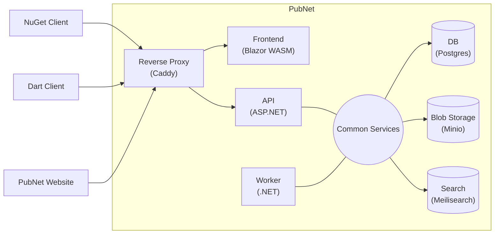
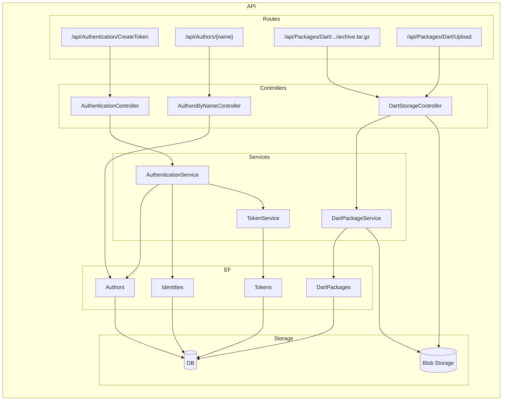
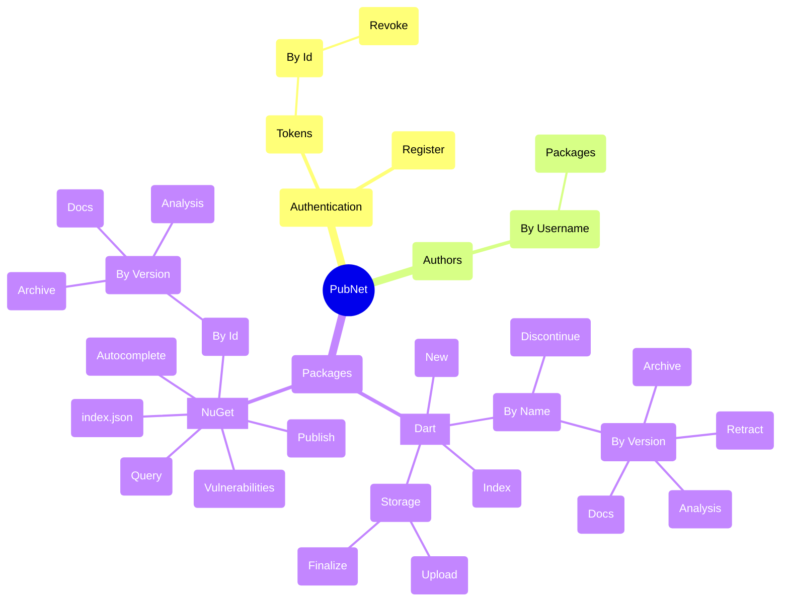
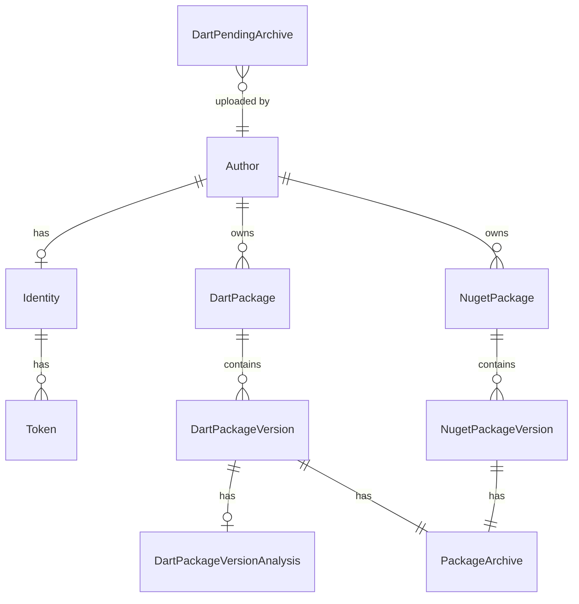

# PubNet Architecture

## High Level Block Diagram

```mermaid
flowchart LR
    nuget[NuGet Client] & dart[Dart Client] & website[PubNet Website] --> caddy["Reverse Proxy<br/>(Caddy)"]

    subgraph PubNet
        caddy --> frontend["Frontend<br/>(Blazor WASM)"] & api["API<br/>(ASP.NET)"]
        api & worker["Worker<br/>(.NET)"] --- common((Common Services))
        common --> db[("DB<br/>(Postgres)")] & storage[("Blob Storage<br/>(Minio)")] & search[("Search<br/>(Meilisearch)")]
    end
```

## API Layers

```mermaid
graph
    subgraph API
        direction TB

        subgraph Routes
            AuthorByNameRoute["/api/Authors/{name}"]
            CreateTokenRoute["/api/Authentication/CreateToken"]
            GetDartArchiveRoute["/api/Packages/Dart/.../archive.tar.gz"]
            PublishDartArchiveRoute["/api/Packages/Dart/Upload"]
        end

        subgraph Controllers
            AuthenticationController
            AuthorsByNameController
            DartStorageController
        end

        subgraph Services
            AuthenticationService
            TokenService
            DartPackageService
        end

        subgraph EF
            Identities
            Authors
            Tokens
            DartPackages
        end

        subgraph Storage
            DB[(DB)]
            Blob[(Blob Storage)]
        end

        CreateTokenRoute --> AuthenticationController
        AuthenticationController --> AuthenticationService
        AuthenticationService --> TokenService
        TokenService --> Tokens
        AuthenticationService --> Identities & Authors
        Identities & Authors & Tokens --> DB

        AuthorByNameRoute --> AuthorsByNameController
        AuthorsByNameController --> Authors

        GetDartArchiveRoute --> DartStorageController
        DartStorageController --> Blob

        PublishDartArchiveRoute --> DartStorageController
        DartStorageController --> DartPackageService
        DartPackageService --> Blob
        DartPackageService --> DartPackages
        DartPackages --> DB
    end
```

## API Overview

```mermaid
mindmap
  root((PubNet))
    Authentication(Authentication)
      Tokens(Tokens)
        By Id(By Id)
          Revoke(Revoke)
      Register(Register)
    Authors(Authors)
      By Username(By Username)
        Packages(Packages)
    Packages(Packages)
      Dart[Dart]
        New(New)
        Index(Index)
        By Name(By Name)
          Discontinue(Discontinue)
          By Version(By Version)
            Archive(Archive)
            Docs(Docs)
            Analysis(Analysis)
            Retract(Retract)
        Storage(Storage)
            Upload(Upload)
            Finalize(Finalize)
      NuGet[NuGet]
        Publish(Publish)
        index.json(index.json)
        Query(Query)
        Autocomplete(Autocomplete)
        Vulnerabilities(Vulnerabilities)
        By Id(By Id)
          By Version(By Version)
            Archive(Archive)
            Docs(Docs)
            Analysis(Analysis)
```

## Database Schema

```mermaid
erDiagram
    Author ||--o| Identity: has
    Identity ||--o{ Token: has
    Author ||--o{ DartPackage: owns
    DartPackage ||--o{ DartPackageVersion: contains
    DartPackageVersion ||--o| DartPackageVersionAnalysis: has
    DartPendingArchive }o--|| Author: "uploaded by"
    Author ||--o{ NugetPackage: owns
    NugetPackage ||--o{ NugetPackageVersion: contains
    DartPackageVersion ||--|| PackageArchive: has
    NugetPackageVersion ||--|| PackageArchive: has
```
