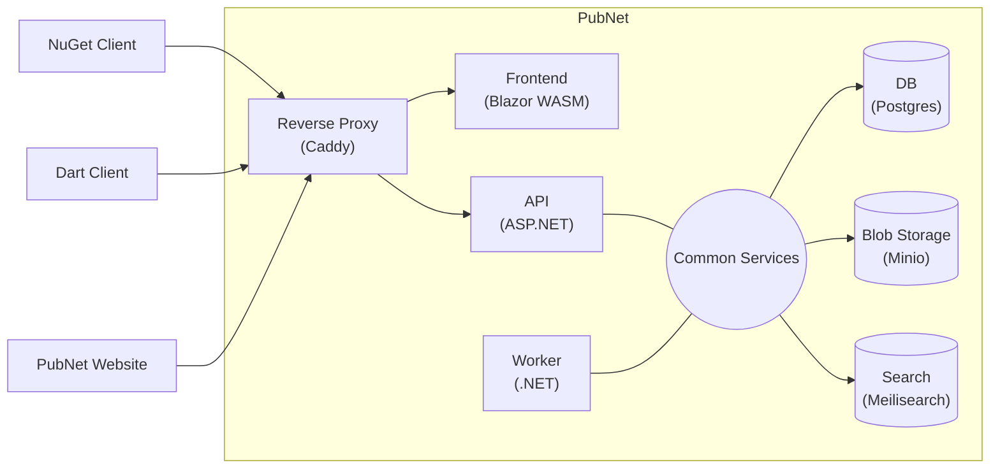
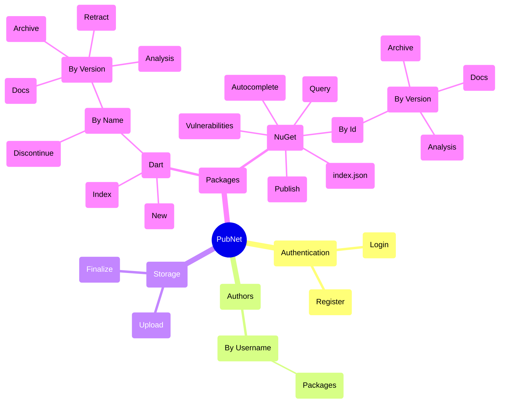

# PubNet Architecture

## High Level Block Diagram

```mermaid
flowchart LR
    nuget[NuGet Client] & dart[Dart Client] & website[PubNet Website] --> caddy["Reverse Proxy<br/>(Caddy)"]

    subgraph PubNet
        caddy --> frontend["Frontend<br/>(Blazor WASM)"] & api["API<br/>(ASP.NET)"]
        api & worker["Worker<br/>(.NET)"] --- common((Common Services))
        common --> db[("DB<br/>(Postgres)")] & storage[("Blob Storage<br/>(Minio)")] & search[("Search<br/>(Meilisearch)")]
    end
```

## API Overview

```mermaid
mindmap
  root((PubNet))
    Authentication(Authentication)
      Login(Login)
      Register(Register)
    Authors(Authors)
      By Username(By Username)
        Packages(Packages)
    Storage(Storage)
        Upload(Upload)
        Finalize(Finalize)
    Packages(Packages)
      Dart(Dart)
        New(New)
        Index(Index)
        By Name(By Name)
          Discontinue(Discontinue)
          By Version(By Version)
            Archive(Archive)
            Docs(Docs)
            Analysis(Analysis)
            Retract(Retract)
      NuGet(NuGet)
        Publish(Publish)
        index.json(index.json)
        Query(Query)
        Autocomplete(Autocomplete)
        Vulnerabilities(Vulnerabilities)
        By Id(By Id)
          By Version(By Version)
            Archive(Archive)
            Docs(Docs)
            Analysis(Analysis)
```
