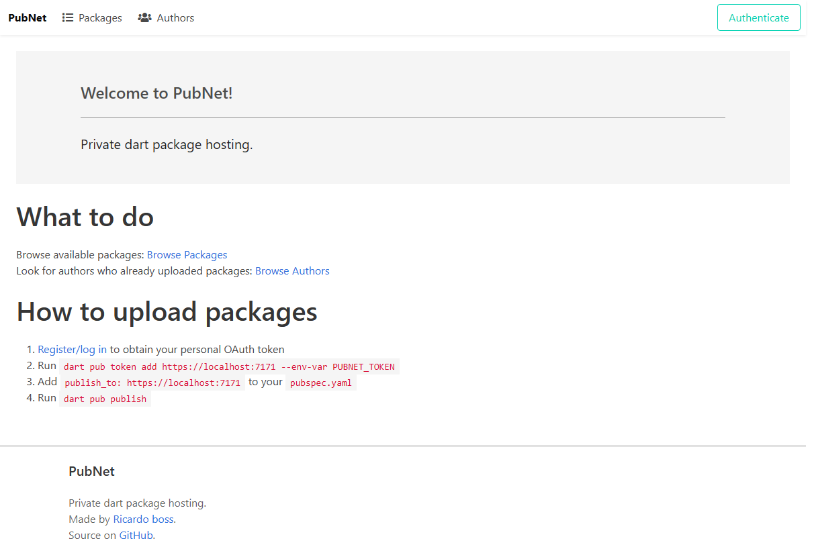
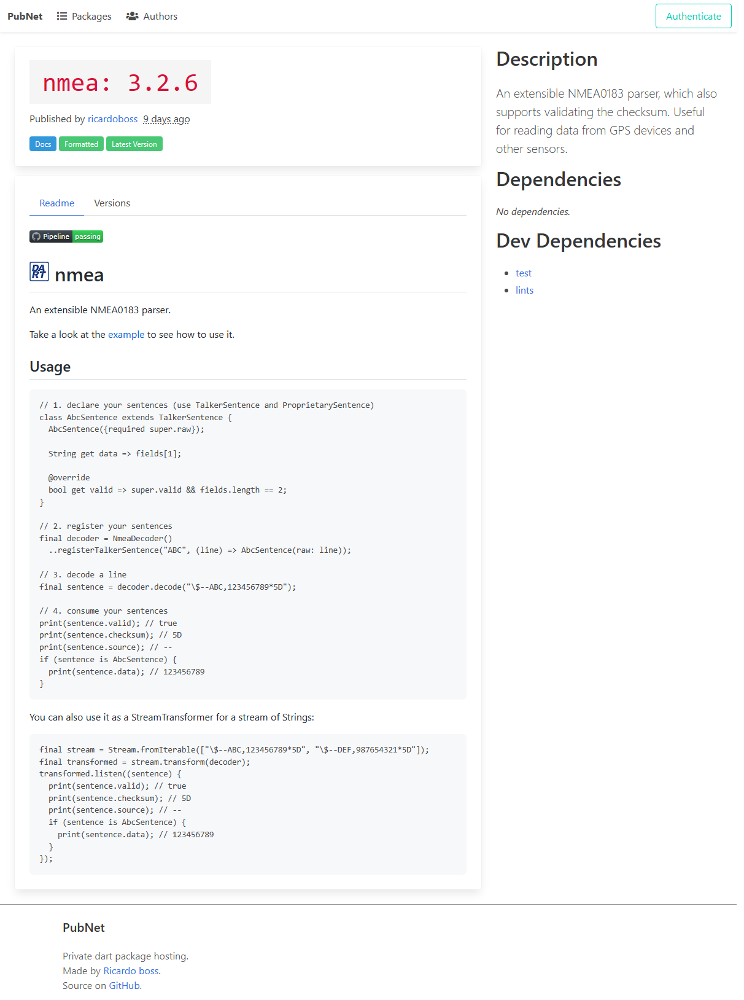
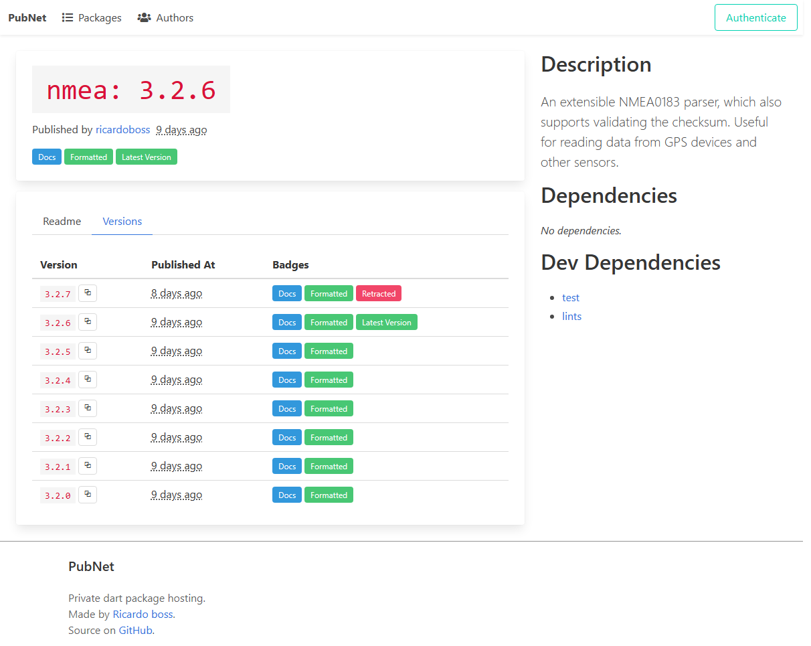

[](https://github.com/ricardoboss/PubNet/actions/workflows/dotnet.yml)
[](https://github.com/ricardoboss/PubNet/actions/workflows/docker-publish.yml)

# PubNet

Self-hosted pub.dev alternative.

## Contents

- [Development](#development)
  - [Architecture](#architecture)
  - [Debugging](#debugging)
- [Contributions](#contributions)
- [Hosting](#hosting)
  - [Using `docker-compose.yml`](#using-docker-composeyml)
  - [Other approaches](#other-approaches)
- [License](#license)
- [Screenshots](#screenshots)

---



## Development

The root of this repository contains a `docker-compose.yml`, which contains three services used to aid in debugging `PubNet`:

- `database`: A postgres database (user: 'pubnet', password: 'pubnet')
- `adminer`: A webinterface for managing the database
- `seq`: A useful logging service

The only service you need to start is `database`, though the other services help during development.

> **Note**
>
> You can also use a database you set up on your host, but currently only postgres is supported.

### Architecture

The solution consists of a few projects, three of them compose the whole PubNet service:

- `PubNet.API`: provides the API used by the `dart pub` command line tool to fetch and upload new packages
- `PubNet.Frontend`: contains a Blazor WebAssembly project to act as a frontend for the API
- `PubNet.Worker`: executes tasks (scheduled and unscheduled) to analyze packages and do general housekeeping

### Debugging

You can use any IDE you want, as long as it supports debugging .NET 7 or higher.

The API needs to be hosted using `https`, because the `dart pub` tool refuses to authenticate against `http` APIs.

> **Note**
> 
> As soon as https://github.com/dart-lang/pub/pull/3777 appears in a release of the `pub` tool, the API can be hosted using `http` 🎉

For the `PubNet.Frontend` project, it is recommended to run it using `dotnet-watch`.

#### Database migrations

This project uses Entity Framework Core with the code-first approach, so migrations are added using `dotnet ef migrations add <name>` and executed using `dotnet ef database update` in the `PubNet.Database` project folder.
Currently, the database project expects the credentials and database name to all be equal to 'pubnet'.

## Contributions

If you want to contribute improvements or bugfixes, fork this repository, create a branch, commit your changes to it and open a pull request here on GitHub.

## Hosting

> **Note**
>
> In case you only need a simple, privately hosted pub package API, the API project alone is sufficient.

When you are ready to deploy `PubNet`, you may want to review the `OpenRegistration` setting in the `backend-appsettings.json` to toggle whether anyone is able to register an account.
This setting can be changed at runtime.

### Using `docker-compose.yml`

<details>
  <summary><code>docker-compose.yml</code> template</summary>

Create a `docker-compose.yml` with the following contents:

```yaml
version: '3.9'

volumes:
  postgres_data:
  pubnet_packages:
  caddy_data:
  caddy_config:

services:
  database:
    image: postgres:latest
    restart: always
    environment:
      POSTGRES_USER: "pubnet"
      POSTGRES_PASSWORD: "pubnet"
    volumes:
      - postgres_data:/var/lib/postgresql/data

  backend:
    image: ghcr.io/ricardoboss/pubnet/api:main
    restart: always
    volumes:
      - "./backend-appsettings.json:/app/appsettings.Production.json"
      - "pubnet_packages:/app/packages"
    depends_on:
      - database
      - caddy

  worker:
    image: ghcr.io/ricardoboss/pubnet/worker:main
    restart: always
    volumes:
      - "./worker-appsettings.json:/app/appsettings.Production.json"
      - "pubnet_packages:/app/packages"
    depends_on:
      - database

  frontend:
    image: ghcr.io/ricardoboss/pubnet/frontend:main
    restart: always
    depends_on:
      - backend
      - caddy

  # you can choose any reverse proxy you want, Caddy is not required
  caddy:
    image: caddy
    restart: always
    volumes:
      - "./Caddyfile:/etc/caddy/Caddyfile"
      - "caddy_data:/data"
      - "caddy_config:/config"
    ports:
      - "80:80"
      - "443:443"
      - "443:443/udp"
```

</details>

> **Note**
>
> In this example, caddy is used as a reverse-proxy.
>
> You can also host the backend and frontend on different ports, and publish them directly, removing the need to configure a reverse proxy entirely.

<details>
  <summary>Reverse proxy configuration (<code>Caddyfile</code>)</summary>

In case you want a reverse proxy, configure it appropriately (in this case using a Caddyfile):

```Caddyfile
*:80, *:443 {
    reverse_proxy /api/* backend:80
    reverse_proxy /* frontend:80
}
```
</details>

<details>
  <summary><code>backend-appsettings.json</code> template</summary>

```json
{
  "AllowedOrigins": [
    "http://localhost"
  ],
  "ConnectionStrings": {
    "PubNet": "Host=database;Database=pubnet;Username=pubnet;Password=pubnet"
  },
  "Jwt": {
    "Issuer": "http://localhost",
    "Audience": "http://localhost",
    "SecretKey": "GenerateASecureKey!"
  },
  "PackageStorage": {
    "Path": "./packages"
  },
  "OpenRegistration": true
}

```

</details>

<details>
  <summary><code>worker-appsettings.json</code> template</summary>

Add a `worker-appsettings.json`:

> You could use the same appsettings for the worker and the backend as their options shouldn't interfere.

```json
{
  "ConnectionStrings": {
    "PubNet": "Host=database;Database=pubnet;Username=pubnet;Password=pubnet"
  },
  "PackageStorage": {
    "Path": "./packages",
    "PendingMaxAge": "00:05:00"
  }
}

```

</details>

Finally, start your own `PubNet` using

```bash
docker-compose up -d
```

and access it at [`https://localhost`](https://localhost).

### Other approaches

It _should_ be possible to host the API using IIS, but it is not supported.

Same goes for the Worker: it _should_ be possible to run it as a Windows service/systemd unit, but is not supported.

The frontend can be hosted from anywhere, as long as the `backend-appsettings.json` contains the domain to allow CORS.

## License

This project is licensed under the Apache 2.0 license. For more information, see [LICENSE](./LICENSE).

## Screenshots

This is a screenshot of how a package looks like after uploading and analysis:



This screenshot shows different versions in a table:


