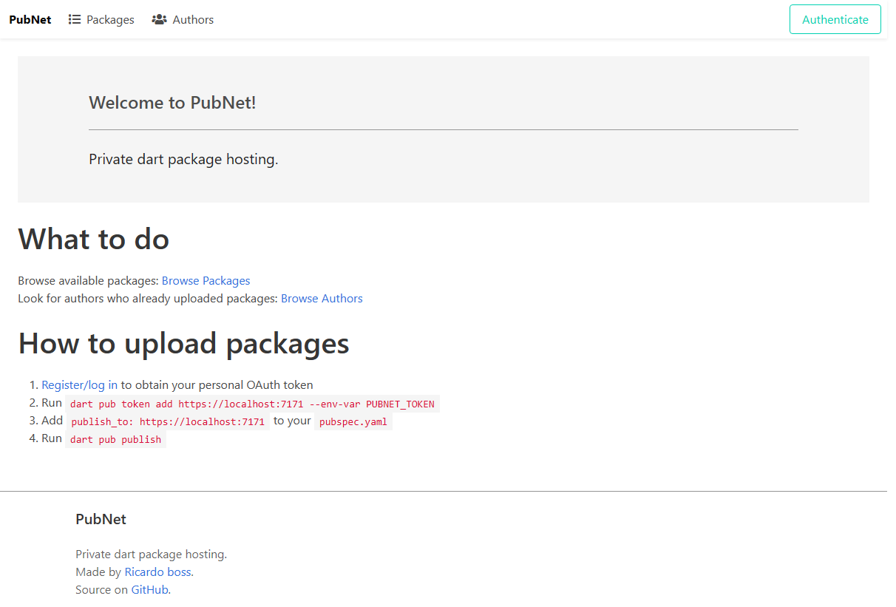
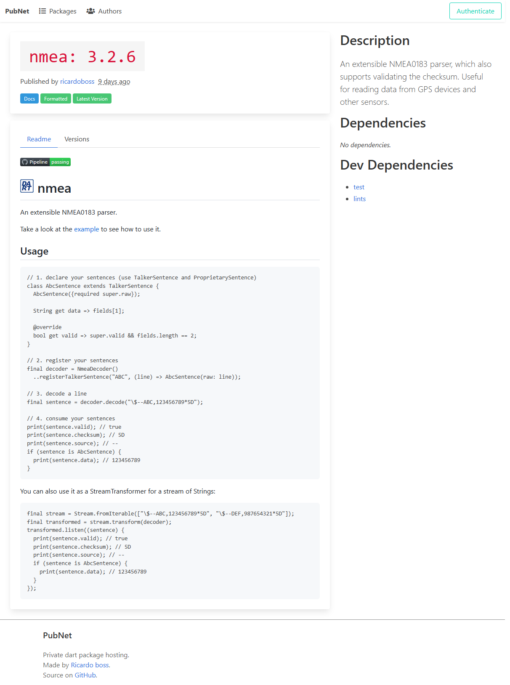
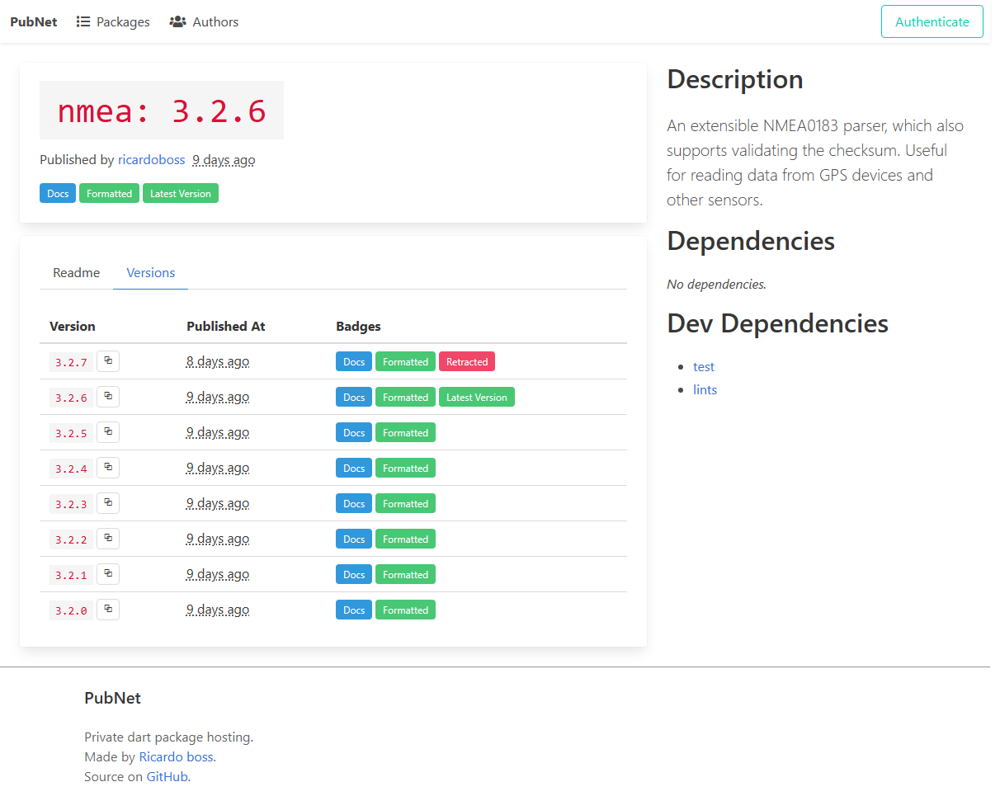

[](https://github.com/ricardoboss/PubNet/actions/workflows/dotnet.yml)
[](https://github.com/ricardoboss/PubNet/actions/workflows/docker-publish.yml)

# PubNet

Self-hosted pub.dev alternative.

## Contents

- [Development](#development)
  - [Architecture](#architecture)
  - [Debugging](#debugging)
- [Contributions](#contributions)
- [Hosting](#hosting)
  - [Administration](#administration)
  - [Instance settings](#instance-settings)
  - [Using `docker-compose.yml`](#using-docker-composeyml)
  - [Other approaches](#other-approaches)
- [License](#license)
- [Screenshots](#screenshots)
- [LLM generated code](#llm-generated-code)

---



## Development

The `src` folder of this repository contains a `docker-compose.yml`, which contains three services used to aid in developing `PubNet`:

- `database`: A postgres database (user: `pubnet`, password: `pubnet`)
- `adminer`: A webinterface for managing the database
- `seq`: A useful logging service

The only service you _need_ to start is `database`, though the other services help a lot.

> **Note**
>
> You can also use a database you set up on your host, but currently only postgres is supported.

### Architecture

The solution consists of a few projects, three of them compose the whole PubNet service:

- `PubNet.API`: provides the API used by the `dart pub` command line tool to fetch and upload new packages
- `PubNet.Frontend`: contains a Blazor WebAssembly project to act as a frontend for the API
- `PubNet.Worker`: executes tasks (scheduled and unscheduled) to analyze packages and do general housekeeping

### Debugging

You can use any IDE you want, as long as it supports debugging .NET 10 or higher.

For the `PubNet.Frontend` project, it is recommended to run it using `dotnet watch` to hot-reload changes.

#### Database migrations

This project uses Entity Framework Core with the code-first approach, so migrations are added using `dotnet ef migrations add <name>` and executed using `dotnet ef database update` in the `PubNet.Database` project folder.
Currently, the database project expects the credentials and database name to all be equal to `pubnet`.

## Contributions

If you want to contribute improvements or bugfixes, fork this repository, create a branch, commit your changes to it and open a pull request here on GitHub.

## Hosting

> **Note**
>
> In case you only need a simple, privately hosted pub package API, the API project alone is sufficient.

When you are ready to deploy `PubNet`, you may want to review the `OpenRegistration` setting in the `backend-appsettings.json` to toggle whether anyone is able to register an account.
This setting, and the other [instance settings](#instance-settings), can also be changed at runtime in the admin backend.

### Administration

Admins get an `Administration` entry in the navigation bar, leading to `/admin`, where they can change the
[instance settings](#instance-settings) and promote or demote authors.
The same operations are available on the API:

| Endpoint                           | Description                                |
|------------------------------------|--------------------------------------------|
| `GET /api/admin/settings`          | The settings and their effective values    |
| `PATCH /api/admin/settings`        | Change settings                            |
| `GET /api/admin/authors`           | All authors, including their roles         |
| `POST /api/admin/authors/{u}/role` | Promote (`1337`) or demote (`0`) an author |

Admins may also discontinue, retract and delete packages they do not own, using the regular package endpoints.

The last remaining admin cannot be demoted or delete their account — promote someone else first.
Since the first-time setup cannot be repeated, an instance without admins could never be administered again.

Roles are checked against the database on every request, so a demotion takes effect immediately instead of when
the author's token expires.

### Instance settings

Settings changed in the admin backend are stored in the database and take precedence over `appsettings.json`
and environment variables. They apply immediately, without a restart, and currently are:

| Key                      | Description                                   |
|--------------------------|-----------------------------------------------|
| `OpenRegistration`       | Whether anyone is able to register an account |
| `HostedUpstream:BaseUrl` | See [Hosted upstream](#hosted-upstream)       |

Everything else — connection strings, `Jwt:*`, `AllowedOrigins`, the package storage path — stays deployment
configuration and can only be changed in the configuration files or the environment.
Clearing a setting in the admin backend deletes its row and falls back to the value from the configuration files.

### Authentication

`PubNet` is a private package host: reading packages and authors requires an account, not just publishing.
Every package and author endpoint is authenticated, including the version listing and the archive download that `dart pub get` uses.

Consumers therefore need a token for the instance:

```bash
dart pub token add https://pubnet.example.com
```

The `dart pub` client handles this on its own: it sends the token when resolving a package, and when it receives a `401` while downloading an archive it retries the request with the token.
For CI, `dart pub token add <url> --env-var PUB_TOKEN` reads the token from the environment instead of storing it on disk.

> **Note**
>
> Because reads are authenticated, closing registrations (`OpenRegistration: false`) is what actually keeps an instance private.
> The first-time setup creates the administrator account; further accounts are created by registration.

### Hosted upstream

`PubNet` can fall back to an upstream hosted repository for package metadata and archives that are not stored locally.

- The default upstream is `https://pub.dev/api/`.
- You can point it at `unpub` by setting `HostedUpstream:BaseUrl` to the upstream API base URL, for example `https://unpub.example.com/api/`.
- Environment variables override JSON configuration in ASP.NET Core, so Docker deployments can use `HostedUpstream__BaseUrl`.
- If the configured value is missing or invalid, `PubNet` falls back to `https://pub.dev/api/`.

Example values:

```json
{
  "HostedUpstream": {
    "BaseUrl": "https://unpub.example.com/api/"
  }
}
```

```bash
export HostedUpstream__BaseUrl="https://unpub.example.com/api/"
```

Important behavior notes:

- The upstream URL must be the API base URL, not just the site root.
- `PubNet` still stores and manages its own local packages, authors, and permissions.
- Only package lookups and archive fallback use the upstream. Package list pages and author data remain local to `PubNet`.
- Mirrored metadata is served by `PubNet` and is authenticated like every other package lookup, so which upstream packages an instance has looked up is not readable without an account.
- Mirrored **archives** are not: `PubNet` answers the download with a redirect to the upstream, and the client fetches those bytes straight from there without a `PubNet` token.
  That content is public upstream anyway and is not hosted by `PubNet`, so this only applies to packages that are not stored locally.
  Archives of locally published packages are served by `PubNet` and stay authenticated.

### Using `docker-compose.yml`

<details>
  <summary><code>docker-compose.yml</code> template</summary>

Create a `docker-compose.yml` with the following contents:

```yaml
volumes:
  postgres_data:
  pubnet_packages:
  caddy_data:
  caddy_config:

services:
  database:
    image: postgres:18
    restart: always
    environment:
      POSTGRES_USER: "pubnet"
      POSTGRES_PASSWORD: "pubnet"
    volumes:
      - postgres_data:/var/lib/postgresql

  backend:
    image: ghcr.io/ricardoboss/pubnet/api:main
    restart: always
    environment:
      HostedUpstream__BaseUrl: "https://unpub.example.com/api/"
    volumes:
      - "./backend-appsettings.json:/app/appsettings.Production.json"
      - "pubnet_packages:/app/packages"
    depends_on:
      - database
      - caddy

  worker:
    image: ghcr.io/ricardoboss/pubnet/worker:main
    restart: always
    volumes:
      - "./worker-appsettings.json:/app/appsettings.Production.json"
      - "pubnet_packages:/app/packages"
    depends_on:
      - database

  frontend:
    image: ghcr.io/ricardoboss/pubnet/frontend:main
    restart: always
    depends_on:
      - backend
      - caddy

  # you can choose any reverse proxy you want, Caddy is not required
  caddy:
    image: caddy
    restart: always
    volumes:
      - "./Caddyfile:/etc/caddy/Caddyfile"
      - "caddy_data:/data"
      - "caddy_config:/config"
    ports:
      - "80:80"
      - "443:443"
      - "443:443/udp"
```

</details>

> **Note**
>
> In this example, caddy is used as a reverse-proxy.
>
> You can also host the backend and frontend on different ports, and publish them directly, removing the need to configure a reverse proxy entirely.

<details>
  <summary>Reverse proxy configuration (<code>Caddyfile</code>)</summary>

In case you want a reverse proxy, configure it appropriately (in this case using a Caddyfile):

```Caddyfile
*:80, *:443 {
    reverse_proxy /api/* backend:80
    reverse_proxy /* frontend:80
}
```
</details>

<details>
  <summary><code>backend-appsettings.json</code> template</summary>

```json
{
  "AllowedOrigins": [
    "http://localhost"
  ],
  "ConnectionStrings": {
    "PubNet": "Host=database;Database=pubnet;Username=pubnet;Password=pubnet"
  },
  "Jwt": {
    "Issuer": "http://localhost",
    "Audience": "http://localhost",
    "SecretKey": "GenerateASecureKey!"
  },
  "PackageStorage": {
    "Path": "./packages"
  },
  "HostedUpstream": {
    "BaseUrl": "https://pub.dev/api/"
  },
  "OpenRegistration": true,
  "SmtpAccount": {
    "Host": "localhost",
    "Port": 1025,
    "TLS": false,
    "Login": "myMtaLogin",
    "Password": "myMtaPassword"
  }
}

```

</details>

<details>
  <summary><code>worker-appsettings.json</code> template</summary>

Add a `worker-appsettings.json`:

> You could use the same appsettings for the worker and the backend as their options shouldn't interfere.

```json
{
  "ConnectionStrings": {
    "PubNet": "Host=database;Database=pubnet;Username=pubnet;Password=pubnet"
  },
  "PackageStorage": {
    "Path": "./packages",
    "PendingMaxAge": "00:05:00"
  }
}

```

</details>

<details>
  <summary>Docker environment variable override</summary>

If you do not want to store the upstream in `backend-appsettings.json`, set it directly in the backend container environment:

```yaml
services:
  backend:
    image: ghcr.io/ricardoboss/pubnet/api:main
    environment:
      HostedUpstream__BaseUrl: "https://unpub.example.com/api/"
```

When `HostedUpstream__BaseUrl` is empty, missing, or not a valid absolute `http`/`https` URL, `PubNet` falls back to `https://pub.dev/api/`.
</details>

Finally, start your own `PubNet` using

```bash
docker-compose up -d
```

and access it at [`https://localhost`](https://localhost).

### Other approaches

It _should_ be possible to host the API using IIS, but it is not supported.

Same goes for the Worker: it _should_ be possible to run it as a Windows service/systemd unit, but is not supported.

The frontend can be hosted from anywhere, as long as the `backend-appsettings.json` contains the domain to allow CORS.

## License

This project is licensed under the Apache 2.0 license. For more information, see [LICENSE](./LICENSE).

## Screenshots

This is a screenshot of how a package looks like after uploading and analysis:



This screenshot shows different versions in a table:



## LLM generated code

This repository contains code generated by LLMs. All code is human-reviewed before merging. PRs using LLM code are allowed.
